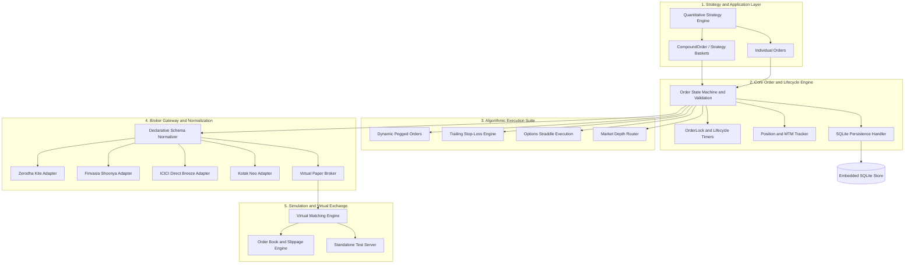
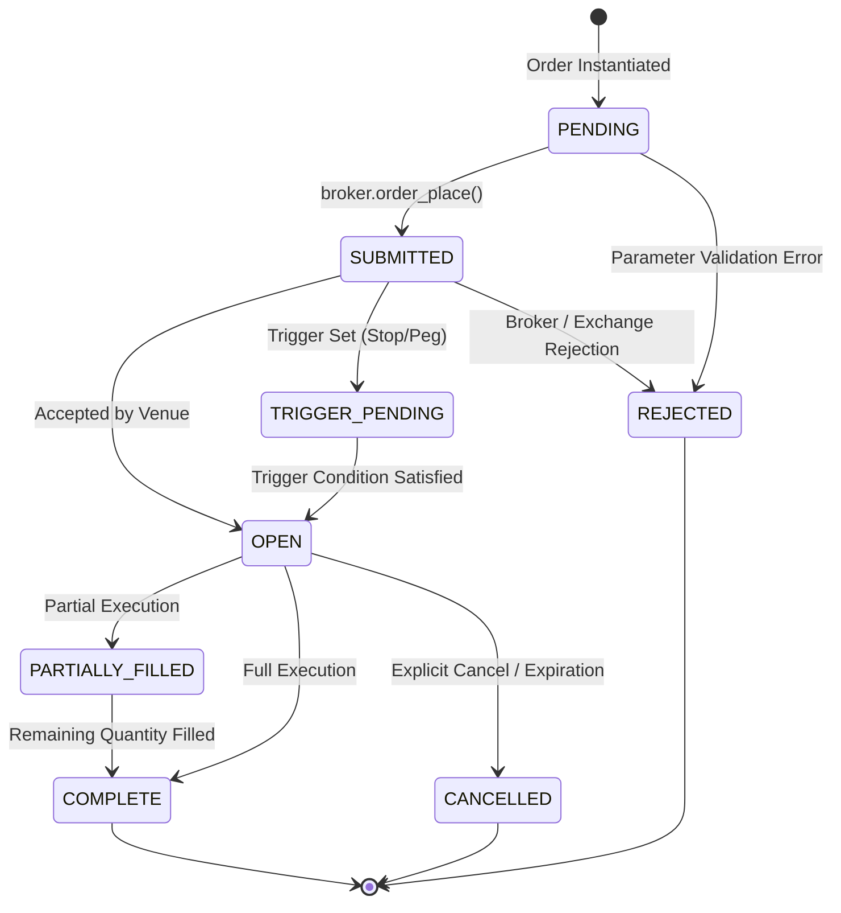
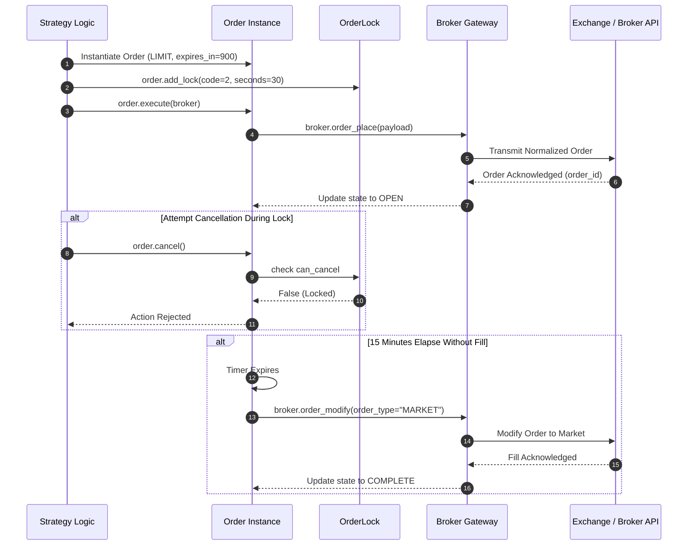
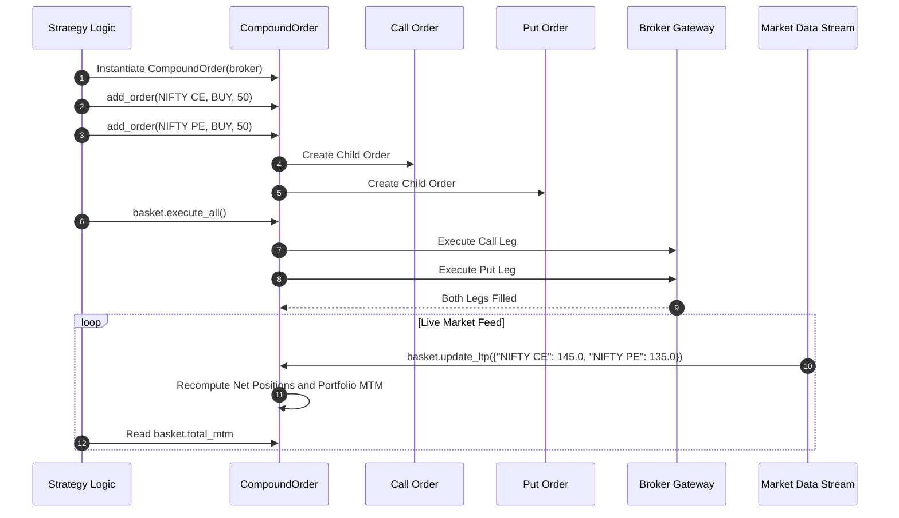
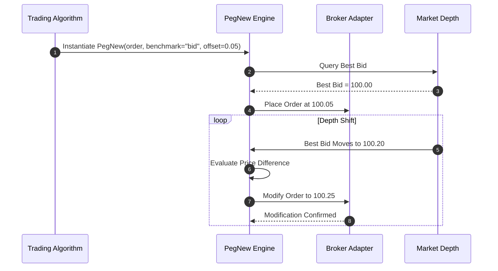

# AlphaRoute: Algorithmic Order Management and Execution Framework

[](https://www.python.org/)
[](https://docs.pydantic.dev/)
[](https://sqlite.org/)
[](#system-architecture)

AlphaRoute is a high-performance, broker-agnostic Python library engineered for quantitative trading, algorithmic order routing, and real-time execution management. It provides institutional and algorithmic traders with a deterministic state machine, unified multi-broker connectivity, multi-leg strategy baskets, and automated risk controls.

By decoupling strategy logic from execution venues through declarative schema normalization, AlphaRoute allows trading algorithms to be written once and deployed across multiple broker endpoints or local simulated exchange environments without code modification.

---

## Core Capabilities

- **Unified Multi-Broker Connectivity**: Standardized interface supporting Zerodha Kite, Finvasia Shoonya, ICICI Direct Breeze, Kotak Neo, and an embedded Paper Broker.
- **Deterministic State Engine**: Strict Pydantic-validated order lifecycles with thread-safe execution locks to eliminate race conditions during high-volatility events.
- **Atomic Multi-Leg Strategy Baskets**: Simultaneous execution and monitoring of multi-leg options, spreads, and pairs with real-time portfolio Mark-to-Market (MTM) calculations.
- **Algorithmic Execution Primitives**: Native support for pegged orders, market-depth routers, automated trailing stop-losses, and options straddles.
- **Simulation and Testing Sandbox**: In-memory matching engine and virtual order book modeling slippage, latency, and partial fills.
- **Crash-Resilient Audit Logging**: Automated SQLite persistence recording every state transition, fill event, and timestamp for auditability and session recovery.

---

## Supported Order Types

| Order Type | Class / Method | Parameters | Behavior | Primary Use Case |
| :--- | :--- | :--- | :--- | :--- |
| **Market** | `Order(..., order_type="MARKET")` | `symbol`, `quantity`, `side` | Executes immediately at the best available bid/ask | Urgent entries and exits, momentum execution |
| **Limit** | `Order(..., order_type="LIMIT")` | `price`, `symbol`, `quantity`, `side` | Rests in order book; fills only at specified price or better | Slippage control, passive liquidity placement |
| **Stop-Loss** | `Order(..., order_type="STOP")` | `trigger_price`, `symbol`, `quantity` | Rests locally or on exchange until trigger price is crossed | Downside capital protection, risk mitigation |
| **Stop-Limit** | `Order(..., order_type="SL-LIMIT")` | `trigger_price`, `price`, `symbol` | Converts to a limit order upon trigger breach | Breakout execution with predefined price ceilings |
| **Time-in-Force** | `Order(..., expires_in=N)` | `expires_in`, `convert_to_market_after_expiry` | Enforces countdown timer; cancels or converts on expiry | Scalping, avoidance of stale limit orders |
| **Pegged** | `PegExisting`, `PegNew` | `order`, `benchmark`, `offset` | Dynamically updates price tracking best bid/ask or depth | Algorithmic execution, market making |
| **Compound Basket** | `CompoundOrder(broker)` | `orders`, `broker`, `ltp` | Executes multiple orders atomically with aggregated MTM | Straddles, strangles, pair trades, brackets |

---

## System Architecture

AlphaRoute separates execution concerns into five modular layers:



### Architectural Responsibilities

1. **Core Order Engine (`alpharoute.order.Order`)**:
   Enforces parameter boundaries via Pydantic schemas. Manages order identifiers, parent-child relationships, execution states, and thread-safe locks (`OrderLock`) to prevent concurrent modifications during active requests.

2. **Multi-Leg Basket Manager (`alpharoute.order.CompoundOrder`)**:
   Coordinates execution across multiple legs. Aggregates gross and net quantities, computes volume-weighted average prices (VWAP), and calculates live Mark-to-Market (MTM) values from incoming ticker feeds.

3. **Broker Gateway Layer (`alpharoute.base.Broker`, `alpharoute.brokers`)**:
   Uses method decorators (`@pre`, `@post`) paired with YAML configuration files to translate internal order representations to broker-specific payloads and back, isolating the strategy from API variances.

4. **Algorithmic Execution Suite (`alpharoute.orders`, `alpharoute.algos`)**:
   Implements intelligent execution behaviors including price pegging against Level 2 order books, multi-tier trailing profit targets, and delta-neutral options deployment.

5. **Simulation Engine (`alpharoute.simulation`)**:
   Provides a full virtual matching engine that emulates limit order book dynamics, fill latencies, and slippage without connecting to external exchange infrastructure.

---

## Order Lifecycle State Machine



---

## Execution Workflows

### Workflow 1: Single Order with Auto-Expiry and Safety Locks

This workflow illustrates creating a limit order that is locked against accidental cancellation and automatically converts to a market order if unfulfilled within 15 minutes.



#### Code Implementation

```python
from alpharoute.order import Order
from alpharoute.brokers.paper import Paper

broker = Paper()

# Define order with automatic market conversion after 15 minutes
order = Order(
    symbol="INFY",
    side="buy",
    quantity=50,
    order_type="LIMIT",
    price=1500.00,
    expires_in=900,
    convert_to_market_after_expiry=True
)

# Apply a cancellation lock for 30 seconds
order.add_lock(code=2, seconds=30)

# Submit to broker
order_id = order.execute(broker=broker)
print(f"Order submitted with ID: {order_id}")

# Verification of lock enforcement
if not order.lock.can_cancel:
    print(f"Order is locked against cancellation until {order.lock.cancellation_lock_till}")
```

---

### Workflow 2: Multi-Leg Options Strategy Execution (Straddle)

This workflow demonstrates deploying an options straddle with simultaneous execution of call and put legs, followed by real-time Mark-to-Market (MTM) calculation from live price ticks.



#### Code Implementation

```python
from alpharoute.order import CompoundOrder
from alpharoute.brokers.paper import Paper

broker = Paper()

# Initialize multi-leg basket
basket = CompoundOrder(broker=broker)

# Configure strategy legs
basket.add_order(symbol="NIFTY26SEP24000CE", side="buy", quantity=50, key="ce_leg")
basket.add_order(symbol="NIFTY26SEP24000PE", side="buy", quantity=50, key="pe_leg")

# Execute all orders atomically
basket.execute_all()

# Stream live ticks to evaluate net exposure and MTM
basket.update_ltp({
    "NIFTY26SEP24000CE": 142.50,
    "NIFTY26SEP24000PE": 138.00
})

print("Net Positions:", dict(basket.positions))
print(f"Gross Portfolio MTM: {basket.total_mtm:.2f}")
print("Completed Orders:", len(basket.completed_orders))
```

---

### Workflow 3: Smart Execution with Dynamic Price Pegging

This workflow demonstrates a pegged order that automatically tracks market depth or the best bid/ask, updating limit prices when the market moves to achieve favorable execution without aggressive market orders.



#### Code Implementation

```python
from alpharoute.order import Order
from alpharoute.orders.peg import PegNew
from alpharoute.brokers.paper import Paper

broker = Paper()

# Base order template
base_order = Order(
    symbol="TCS",
    side="buy",
    quantity=10,
    order_type="LIMIT",
    price=3800.00
)

# Peg order 0.10 above the current market bid
pegged_order = PegNew(
    order=base_order,
    broker=broker,
    benchmark="bid",
    offset=0.10
)

# Trigger initial placement
pegged_order.run()
```

---

### Workflow 4: Transactional Persistence and Crash Recovery

This workflow details automatic database persistence via SQLite. Order states, executions, and error responses are written synchronously, allowing full state recovery if an application process restarts.

```python
from alpharoute.order import Order, create_db

# Initialize persistent SQLite store
db = create_db("trading_session.db")

# Create order and attach database connection
order = Order(
    symbol="RELIANCE",
    side="buy",
    quantity=100,
    order_type="LIMIT",
    price=2950.00
)
order.connection = db

# Explicit persist to SQLite table
order.save_to_db()

# Query recorded audit trail
for record in db["orders"].rows:
    print(f"[{record['timestamp']}] ID: {record['id']} | "
          f"{record['symbol']} {record['side']} x{record['quantity']} | "
          f"Status: {record['status']}")
```

---

## Package Structure

```text
alpha-route/
├── alpharoute/
│   ├── __init__.py           # Package exports
│   ├── base.py               # Abstract Broker base class and YAML schema engine
│   ├── order.py              # Order and CompoundOrder core state machine
│   ├── models.py             # Domain models (OrderLock, Candlestick, Tracker)
│   ├── multi.py              # Multi-account and multi-broker routing utilities
│   ├── utils.py              # Mathematical, datetime, and validation helpers
│   ├── algos/                # Algorithmic strategy engines
│   │   ├── straddle.py       # Systematic options straddle engine
│   │   └── trailing.py       # Dynamic trailing stop-loss manager
│   ├── brokers/              # Broker adapters with declarative YAML specs
│   │   ├── zerodha.py        # Zerodha Kite Connect adapter
│   │   ├── finvasia.py       # Finvasia Shoonya adapter
│   │   ├── icici.py          # ICICI Direct Breeze adapter
│   │   ├── neo.py            # Kotak Neo adapter
│   │   ├── noren.py          # Noren REST API adapter
│   │   └── paper.py          # Local simulated paper broker
│   ├── orders/               # Advanced algorithmic order types
│   │   ├── peg.py            # Dynamic pegged order engine
│   │   ├── stop.py           # Stop and stop-limit execution
│   │   └── depth.py          # Market depth-aware execution
│   └── simulation/           # Virtual exchange and matching engine
│       ├── virtual.py        # Virtual broker implementation
│       ├── models.py         # Simulated order book and matching engine
│       └── server.py         # Standalone simulation server
├── tests/                    # Unit and integration test suite
├── docs/                     # Documentation sources
├── pyproject.toml            # Poetry dependencies and package configuration
└── README.md                 # System documentation and architecture guide
```

---

## Installation

### Using Poetry

```bash
# Clone the repository
git clone https://github.com/aanshiomar31-oss/alpha-route.git
cd alpha-route

# Install dependencies
poetry install

# Activate the virtual environment
poetry shell
```

### Using Pip

```bash
pip install .
```

---

## Testing and Verification

Run the test suite using `pytest`:

```bash
poetry run pytest tests/
```

To run tests with coverage metrics:

```bash
poetry run pytest --cov=alpharoute tests/
```

---

## Planned Enhancements

- **Asynchronous Execution Engine**: Complete `asyncio` and `httpx`-based broker gateways for high-concurrency order placement.
- **Pre-Trade Risk Management**: Pre-execution margin validation, max order value ceilings, and automatic drawdown circuit breakers.
- **WebSocket Depth Feeds**: Direct integration of Level 2 and Level 3 order book streaming into pegged order logic.
- **Institutional Protocol Support**: FIX (Financial Information eXchange) 4.2 / 4.4 protocol adapters for direct market access (DMA).


